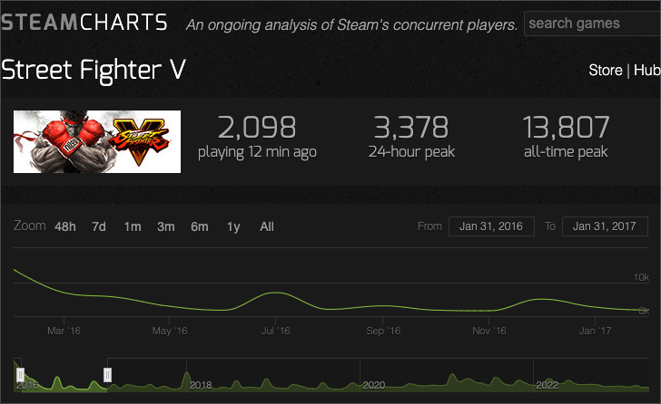
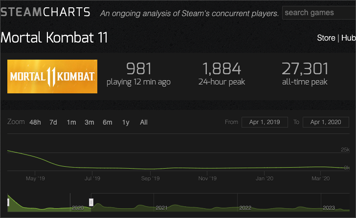

## Introduction
In Street Fighter 6, there are three control schemes to choose from: Classic, Modern, and Dynamic Controls. The main difference between these schemes is the complexity of inputs required for executing moves. Let's discuss the implications of these three control schemes on the player base and the game's competitive scene.

## Dynamic Controls 
This is going to be short and sweet.  Dynamic Controls allow the game to make the best decision for the button you press, based on factors like your distance from the opponent and how much meter you have.

This is easy mode on steroids.  If you want to just press buttons, have fun, and not worry about the intricacies, this move is for sure.  But chances are, if you’re reading this, you’re trying to actually learn the game and get better. 

Since this mode is not available for in online matches, it’s competitively irrelevant.  

## Classic vs. Modern at a Glance 
| Aspect                      | Classic Controls                             | Modern Controls                                    |
| --------------------------- | -------------------------------------------- | -------------------------------------------------- |
| Inputs                      | Precise controller inputs and button presses | Simplified inputs for Specials and Supers          |
| Execution Difficulty        | High                                         | Low                                                |
| Muscle Memory Required      | Yes                                          | Less demanding                                     |
| Accessibility for Newcomers | Not so much                                  | More accessible                                    |
| Damage Output               | Unchanged                      | Reduced damage on Specials and Supers |
| Flexibility                 | N/A                                          | Allows for both motion inputs and shortcuts        |

## Classic Controls
Classic Controls involve precise joystick movements and button presses, which have been the norm in fighting games for years.  If you’ve played previous iterations of the game, this control scheme will be familiar to you.  

You have access to three strengths of punches, and three strengths of kicks, and have to do all the specials, Supers, and combos the old-fashioned way, just like our forefathers used to do. 

This control scheme provides a sense of accomplishment and satisfaction for those who invested the time required to be able to execute complex combos in high-pressure situation, but it’s fair to say it’s also been a barrier for newer or casual players who may struggle with the execution difficulty. 

The large amount of upfront investment of time has likely been a big reason why countless players put down the game after their initial hype and enthusiasm dies down.  

| Month          | Avg. Players | Gain         | % Gain       | Peak Players |
| -------------- | ------------ | ------------ | ------------ | ------------ |
| February 2016  | 5,895.9      | -            | -            | 13,807       |
| March 2016     | 2,957.1      | *-2,938.8*     | *-49.85%*      | 6,961        |
| April 2016     | 2,249.6      | *-707.5*       | *-23.93%*      | 5,527        |
| May 2016       | 1,508.5      | *-741.1*       | *-32.94%*      | 2,915        |
| June 2016      | 1,089.5      | *-419.0*       | *-27.77%*      | 1,759        |
| July 2016      | 2,124.8      | **+1,035.3** | **+95.02%**  | 6,931        |
| August 2016    | 1,332.0      | *-792.8*       | *-37.31%*      | 2,015        |
| September 2016 | 1,166.5      | *-165.6*       | *-12.43%*      | 3,020        |
| October 2016   | 1,148.5      | *-17.9*        | *-1.54%*       | 1,765        |
| November 2016  | 1,107.0      | *-41.5*        | *-3.61%*       | 1,581        |
| December 2016  | 1,550.1      | **+443.1**   | **+40.02%**  | 4,999        |
| January 2017   | 1,673.5      | **+123.4**   | **+7.96%** | 2,667        |
| February 2017  | 1,344.0      | *-329.5*       | *-19.69%*      | 1,823        |
Source: [Steam Charts](https://steamcharts.com/app/310950#All)

As you can see, in about a year, the average number of players declined from 5,895.9 to just 1,089.5 in June.  ***That’s a decrease of 81%***!  

Granted, these are only the players on Steam, but I don’t see why the dropoff of PS4 players would be much different.  

But is it just that people thought Street Fighter V sucked and that’s why they stopped?  

Let’s look at Mortal Kombat 11:

| Month        | Avg. Players | Gain      | % Gain     | Peak Players |
|--------------|--------------|-----------|------------|--------------|
| April 2019   | 15,420.0     | -         | -          | 27,301       |
| May 2019     | 6,614.8      | *-8,805.3*| *-57.10%*  | 18,629       |
| June 2019    | 2,994.5      | *-3,620.3*| *-54.73%*  | 5,735        |
| July 2019    | 1,944.6      | *-1,049.9*| *-35.06%*  | 3,728        |
| August 2019  | 1,575.5      | *-369.0*  | *-18.98%*  | 3,283        |
| September 2019| 1,117.9     | *-457.6*  | *-29.04%*  | 2,150        |
| October 2019 | 1,367.1      | **+249.2**| **+22.29%**| 3,664        |
| November 2019| 1,378.0      | **+10.9** | **+0.80%** | 3,174        |
| December 2019| 1,715.2      | **+337.2**| **+24.47%**| 3,518        |
| January 2020 | 1,948.3      | **+233.1**| **+13.59%**| 3,909        |
| February 2020| 2,005.0      | **+56.6** | **+2.91%** | 4,384        |
| March 2020   | 1,998.6      | *-6.4*    | *-0.32%*   | 5,016        |
| April 2020   | 1,720.5      | *-278.2*  | *-13.92%*  | 3,639        |
Source: [Steam Charts](https://steamcharts.com/app/976310)

***Average players decreased 88% in the first year***, so clearly this is not a trend that’s limited to just Street Fighter.  

## Enter Modern Controls
Modern Controls are a brand-new control scheme that reduces the damage output of some moves in exchange for significantly easier inputs on Specials and Supers. 

For example, you can do one-button Specials, such as Ryu's Fireball or DP, which makes it a lot easier for newer and casual players to have fun with the game. Rather than needing to practice the traditional QCF+P motion for a Fireball, Ryu can just press the Special button and the Fireball will come out.

Why is this important? 

Well, when you lower the execution barrier, it has the potential to change quite a lot. As someone who's played in arcades since I was a kid, I can tell you I've spent countless hours practicing combos in Training Mode so that I could land them in real matches in high-pressure situations.

But obviously, the vast majority of players aren't going to invest the time that it takes to be dedicated enough to build the muscle memory required to play fighting games at a high level.  Especially when they are brand new to the franchise and get destroyed when they decide to hop  online. 

Modern Controls, offer a more accessible option for new players. With simplified inputs for Specials and Supers, the execution difficulty is significantly lower. This control scheme requires less muscle memory, making it easier for newcomers to pick up the game, and hopefully stick with it. 

## Impact on Competitive Scene
It's too early to tell what the real impact of Modern Controls will be on the competitive landscape. Initially, many people thought there was a 20% damage reduction when using Modern Controls, but further investigation has shown that it's not that simple. 

The damage output depends on whether a player uses motion inputs or the Special button, with the latter resulting in slightly lower damage.

Source: /u/FGCDaily 

This image and compares the damage of Luke’s Level 2 between Classic, Modern doing the full input of the super, and Modern using the shortcut (Special + Heavy). 

It turns out that the damage on Classic and Modern when you do the motion is exactly the same. But when you use the shortcut in Modern Controls, the super does about 20% less damage.

Sure, it’s noticeable, but It's not so low that you could immediately write it off and say it's not worth it.

The difference is pretty minimal in this situation, whereas the difference from a raw Super is more noticeable.  

However, in exchange for the ease of execution, there are definite limitations. 

For example, when Luke is in Modern Controls, he doesn't have access to his B+HK, which is his most damaging Punish Counter normal after blocking a DP or another high-risk reversal.

In Modern Controls, Ryu has no access to st. MK, one of his best pokes, and j. MP, which can lead to air juggle combos. 

Even taking into account these limitations, what’s most important is that with Modern Controls, you can start off by using the shortcuts, then gradually integrate the full motion inputs into your game over time. 

This could be an appealing option, even for serious players, because it allows you to get familiar with characters faster, which will speed up the process of learning matchups.  

Either way, now players get the opportunity to choose whether they would rather dedicate the time it takes to improve their execution upfront, or gradually build up the muscle memory for higher-damage combos over time.  

Although it’s unlikely that the next Capcom Cup champion will be playing on Modern Controls, don’t be surprised if there is eventually a new crop of high-level players that strictly play on Modern.  

Next, we’ll go into detail about how Modern Controls work. 