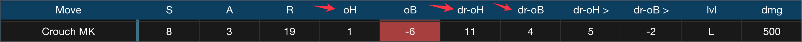
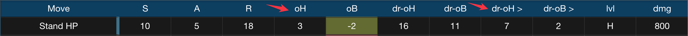
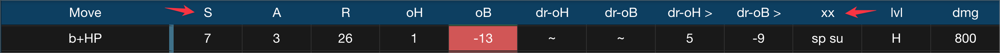
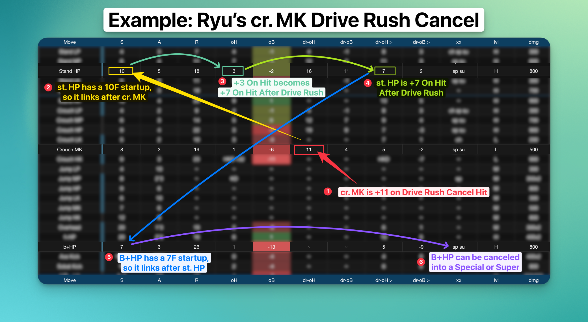
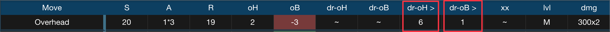
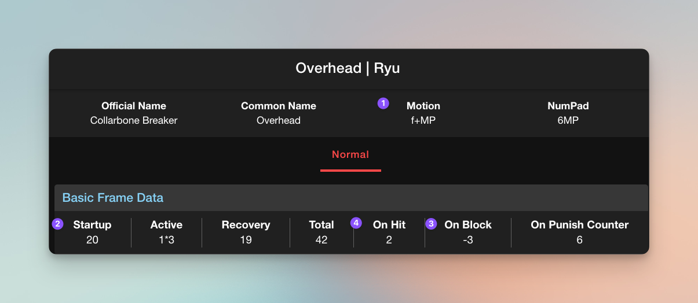
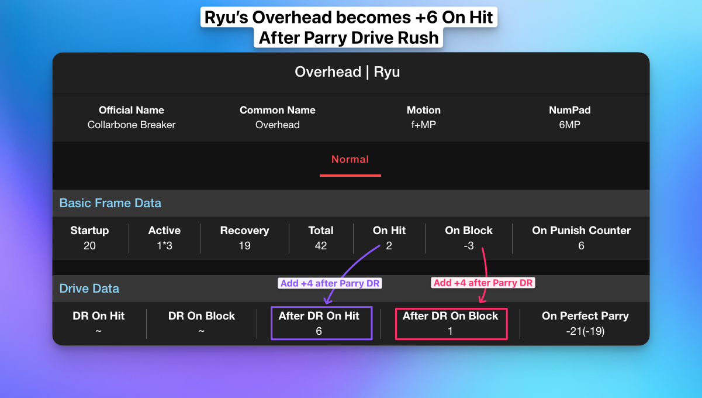

Dri---
created: 2023-04-01 10:37 AM
updated: 2023-04-27 12:10 PM
title: The Drive System Part I
tags: drive-gauge drive-rush parry-drive-rush
---

## Drive System Overview

The drive system is one of the biggest changes in Street Fighter 6 compared to Street Fighter 5. The drive system allows for all kinds of defensive and offensive options, and it's the resource system that you'll be using most frequently in the game. It's represented by the drive gauge, which you can see underneath the life bar. Both players start each round with a full drive gauge.

## Impact on Gameplay Dynamics

Because you start each round with a full drive gauge, all the different options the drive gauge gives you access to are available immediately at the beginning of each round. 

This changes the dynamic of the opening round compared to previous Street Fighter games. 

In Street Fighter IV, V, and III: Third Strike, you start with zero resources and build them up as the round progresses.

For example, in Street Fighter 5, special moves can be upgraded to EX special moves by spending one of your four available EX stocks. 

EX special moves typically have special properties. 

Ryu's EX fireball, for instance, hits twice instead of once and knocks down. 

His EX Donkey Kick gains the wall bounce property, which means you can juggle afterwards. 

EX DPs, like Ken and Ryu, gain invincibility, extra damage, and additional hits. 

But at the beginning of the round, none of this is available, which means that your offensive options are limited during the early part of the first round.

## OD Moves 
In Street Fighter 6, EX moves have been replaced by OD Moves, which work the same way, except they cost two stocks of drive gauge. So one third of your bar, and you start each round with all six stocks. 

In Street Fighter V, your EX stocks carry over from round to round, but in Street Fighter 6, you start each round with all six. 

In Street Fighter V, your V-Gauge would reset every round, incentivizing you to use your V-Trigger, V-Reversal, or V-Dash since it's going to reset at the end of the round anyway.

> [!note]
The last Street Fighter game that started you off with all your offensive resources was the Alpha series, and the Marvel vs. Capcom series also starts you with one super meter.
>
> If you played any of those games, that should give you a better idea of how starting with resources affects the beginning of each round.

## Encouraging Faster Openings
In Street Fighter 6, not only are you incentivized to use your drive gauge every round, but you also have the option to use any drive gauge options from the very beginning of the round. 

This encourages a faster opening of each round because, in addition to the OD Moves that are immediately accessible, there are also Drive Rush Cancels and Drive Rush Parry. We'll get into those next.

## Drive Rush Cancels

### Understanding Drive Rush

Drive Rush is performed by inputting a dash during a normal that is special cancelable. 

It costs three Drive Gauge stocks, which means you can only do a maximum of two before you run out of meter. 

Drive Rush allows you to cancel a normal into a dash, which carries you forward quite a long way and adds a significant amount of On Hit frames. 

In addition to the first Normal that you Drive Rush, the second Normal you connect with gains +4 on hit and on block.

### A Basic Example with Ryu
> [!caution]
> cr. MK xx Drive Rush, st. HP, B+HP xx HK Donkey Kick (**2179 dmg**)

Ryu can Drive Rush Cancel his cr. MK (or any other normal that’s cancelable). 

If the cr. MK hits, he is +11.  If it’s blocked, he is +4.

Without canceling into Drive Rush, cr. MK is only +1 on hit. So by canceling into drive rush, you get an extra 10 frames of advantage. 

Since he's now +11 after the drive rush cancel, it opens up new combo opportunities that wouldn't be possible otherwise, such as linking into st. HP, which has a 10-frame startup.

Because cr. MK is normally only +1 on hit, you wouldn’t be able to link into st. HP without Drive Rush.  

But with Drive Rush, this new link is possible and pretty easy to do.  

So then what happens after this st. HP hits?

#### Without Drive Rush 
Off of a normal st. HP (without the preceding Drive Rush), you aren’t able to link into another normal because it's only +3 on hit.  

Since Ryu doesn’t have any attacks with a 3F startup, your only option would be to cancel the st. HP into any of his special moves, such as his fireball, DP, or Donkey Kick, which would be the end of the combo.

#### After Drive Rush
In this example, the Hit Advantage of the original cr. MK increases after the Drive Rush Cancel (going from +1 to +11)

After the cr. MK drive rush cancel, st. HP goes from being +3 on hit to being +7 on hit after the Drive Rush. 

This is because the frame advantage increase from the Drive Rush Cancel applies to the first and second hit of the combo.  

> [!caution]
> The `dr-oH >` and `dr-oB >` columns of the frame data on fullmeter.com are always +4 of their `oH` and `oB` counterparts.

This four-frame increase from +3 to +7 On Hit allows you to link into another normal with a startup of seven frames or less. 

> [!tip]
> Ryu only has one grounded 7F normal: his B+HP, which does 800 damage, forces a stand on hit, and is cancelable into a special move or any of his supers. 

The B+HP can be canceled into HK Donkey Kick, resulting in total damage of 2179 and significant corner push.  However, that would likely be the end of the momentum, as the opponent would be pretty far away. 

> [!tip]
> Alternatively, you could substitute the HK Donkey Kick for HP DP, which would increase the damage by 51 points to 2230.

Without doing the Drive Rush Cancel, you would be limited to `cr. MK xx MK Donkey Kick`, which only does 1380 damage, by comparison. 

However, through the use of Drive Rush Cancel at the cost of three Drive Gauge stocks, you increase the damage from 1380 to 2179 in this basic example.

This is a 58% increase in damage at the cost of half of your Drive Gauge!  

> [!tip]
> When considering whether it's worth it to spend the bar, don't just consider the damage and percentage increase.  
> 
> Remember to also consider the positioning, the life bars, and both player's Drive Gauges.

#### Is it worth it?
A 58% increase in damage certainly seems like a big increase.  But is it worth the bar? 

That depends on the situation, as there could be times where you can end the round through spending the remainder of your bar.  

This example just illustrates the combo extension possibilities that are afforded from landing one cr. MK.  

There are many other situations where it might not be worth it to spend half your Drive Gauge because an OD Special Move might be a better choice.

#### OD Donkey Kick Alternative
Consider this combo that also starts with cr. MK: 

> [!caution]
> cr. MK xx OD Donkey Kick (*wall bounce*), B+HK xx MP DP (**2140 dmg**)

By spending two Drive Gauge stocks on OD Donkey Kick, you deal 2140 instead of 2179 damage, a decrease of 39 points or about 1% less.  

You also can continue the offensive pressure because the MP DP doesn’t push the opponent as far away as the HK Donkey Kick does.

So although you do 1% less damage with the OD Donkey Kick, you are spending 33% less of your Drive Gauge because it only costs you two bars instead of three.  

> [!warning]
> The OD Donkey Kick example only works if you're far enough away from the corner that the B+HK will connect.  If you're too close to the corner, they'll fly over your head.

## Parry Drive Rush

Parry Drive Rush is another offensive tool that’s part of every character’s Drive System repertoire.

It’s similar to Drive Rush Cancel in the sense that it can be used to initiate offense as well as extending combos.

You perform the Parry Drive Rush by inputting a dash while holding down the parry (MP+MK). 

This is definitely the mechanic that I found most confusing.

Admittedly, it's probably also the one that I know the least about. But I'm going to do my best.

### Why Parry Drive Rush is confusing

Part of the reason why I think this particular mechanic is confusing is because of its name and also its input.

As we'll cover later in more detail, the Drive Parry is a defensive mechanic that's similar to the parry in Street Fighter III Third Strike as well as the parry mechanic that some characters like Ryu and M. Bison have in Street Fighter V.

But that's where the similarities end, because the Parry Drive Rush, to my knowledge, can't be used defensively, at least not in the way that you would expect.

You might think that because the input is done starting with the parry, you can parry an attack and then Parry Drive Rush into a counter-attack. 

Unfortunately, it just doesn't work that way because when you do a regular Drive Parry, you don't get anywhere near the number of frames required for the Parry Drive Rush to connect.

It might be possible after a Perfect Parry, but at this point, it also doesn't even seem necessary because you have so much time when you hit a perfect parry that you wouldn't need to Parry Drive Rush.

The other reason why it's confusing is the input. 

Because of the name and the input, you think that it is somehow connected to the regular Drive Parry, but it's not.

### Using Parry Drive Rush as a combo extender

Let's take a closer look at how it can be used as a combo extender.

First, we're going to examine the input. In order to Parry Drive Rush, you have to hold parry (meaning holding MP and MK together), and during the parry animation, which you can hold for an extended period of time, if you input the dash (meaning if you tap forward twice), then you get the Parry Drive Rush, which looks quite similar, if not exactly the same, as the Drive Rush Cancel.

But it's not the same as the Drive Rush Cancel because instead of canceling a normal into the Drive Rush, which results in a dash, in this case, you're canceling the parry animation instead. 

So that means it can be executed in the middle of a combo as a means to close the gap through the dash and then extend the combo with a juggle.

#### Ryu Parry Drive Rush Combo Extension #1 
For example, if Ryu has "Denjin Mode" activated by pressing `D, D+P`, the palm gets a juggle potential boost. If you hit them with the palm while they're in the air, they'll stay in the air longer if you have Denjin Mode activated.

The extra time they spend in the air gives you enough time to Parry Drive Rush, which moves you forward and then allows you to juggle with st. HP or cr. HP, which you can then cancel into a special, such as HK Donkey Kick, or canceling into his Level 3 Super.

Here's the example:

After activating Denjin Mode with `D,D+Punch`, follow these steps to perform the combo:

1.  Land a cr. MK to start your combo. It's a solid low attack that can catch your opponent off-guard.
2.  Cancel the cr. MK into the Overdrive (OD) Donkey Kick by performing a QCF+KK. The OD version of Donkey Kick has a wall bounce property.
3.  After the wall bounce, your opponent will be in a juggle state. Perform the Palm (QCB+P) to juggle as they bounce off the wall.  Because Denjin is active, the Palm will keep your opponent airborne for a bit longer.
4.  Hold Parry (MP+MK), then dash (F, F) and release Parry to do the Parry Drive Rush.
5.  As your opponent is falling to the ground and the Parry Drive Rush carries you forward, press st. HP and cancel into HK Donkey Kick.

In summary, the combo sequence is: 
> [!example] Activate Denjin > Crouching Medium Kick > OD Donkey Kick > Wall Bounce > Palm > Parry Drive Rush > Standing Heavy Punch > HK Donkey Kick

This deals *2,705 damage* at the cost of three of your Drive Gauge bars: *two for the OD Donkey Kick* and *one for the Parry Drive Rush*.

What makes Parry Drive Rush so interesting is its low cost compared to Drive Rush Cancel. 

Drive Rush Cancel costs three bars or half of your Drive Gauge, whereas Parry Drive Rush only costs one bar or one-sixth of your Drive Gauge. 

So it costs 1/3 as much as Drive Rush Cancel does.

This means that if you have the opportunity to extend a combo with it, it's almost always going to be worth it to spend one bar to do so. 

The only time it might not be worth it is if you only had one bar left. 

Other than that, it seems like it would always be worth it given the opportunity to extend the combo.

#### Parry Drive Rush and Its Connection to Street Fighter IV

As a side note, Street Fighter IV players might find the Parry Drive Rush to be somewhat reminiscent of Focus Attack Dash Cancel (FADC) in Street Fighter IV. 

You could use the FADC to cancel special moves into a dash and extend the combo, and it was done with the same input - holding MP and MK together and then tapping forward twice. 

In Street Fighter IV, MP and MK were the commands for Focus Attack. Other than that, the input and its usage are pretty similar.

In Street Fighter IV, you could cancel a special move with FADC at the cost of two bars. 

Ryu could perform a `MP DP → FADC Ultra`, which would allow him to cancel the DP into a dash and then juggle with the Ultra. 

Street Fighter IV players will also remember that you could absorb a hit while charging the Focus Attack and then cancel the Focus Attack into a dash. And this tactic didn’t cost any meter at all.

This leads us to another way that you can use Parry Drive Rush, which is to initiate offense.

### The “After Drive Rush” Columns 
To better understand how Parry Drive Rush works, we need to look at the "after Drive Rush on hit" and "after Drive Rush on block" columns. 

It wasn't until I had the frame data in front of me, thanks to fullmeter.com, that I was able to understand this mechanic. 

When you parry Drive Rush and then press a button, the "after Drive Rush on hit" and "after Drive Rush on block" columns come into play. 

When you start offense this way, the frame advantage is the same as it is on the second hit after a Drive Rush Cancel.

Recall that in the earlier Drive Rush Cancel example, we started with `cr. MK xx Drive Rush Cancel, st. HP`.

The cr. MK is +11 off of a Drive Rush Cancel that hits, and the second move, st. HP, is +7 after Drive Rush on hit. 

If you perform a Parry Drive Rush followed by a st. HP and it hits, you'll be +7. If it's blocked, you'll be -3. 

This is because the `after Drive Rush on hit` and `after Drive Rush on block` columns are always +4 more than the regular on-hit and on-block columns. 

> [Shout outs to Juicebox Abel for pointing that out, as I haven't seen anybody else make that observation.] 

### Initiating Offense with Parry Drive Rush

In addition to extending combos by performing a Parry Drive Rush in the middle of a combo, the other way to use it is by initiating offense with it. 

The best example to illustrate why this is useful is with Ryu's Parry Drive Rush Overhead. 

First let’s take a closer look at the frame data of the Overhead by itself, without the Parry Drive Rush.

1. F+MP is the input. 
2. Ryu's Overhead has a 20-frame `Startup` and, even though it only does 600 damage, it has to be blocked high. 
3. `On Block`, it's -3, which basically makes it unpunishable.
4. `On Hit`, it's +2. 

Being -3 On Block makes it essentially unpunishable because there are no three-frame normals or specials.  The fastest normals are four frames in SF6. 

Additionally, there are no invincible reversals that come out in less than five frames. So, -3 in this case means it's safe, but if they block it, it's the end of your turn.

When using Parry Drive Rush into Overhead, the overhead leaves you +6 on hit and +1 on block. 

Being +6 on hit is good enough to combo into a st. MP, which has a 6-frame startup, or a cr. MP, which also has a 6-frame startup. 

Let's go with cr. MP for now, which does 700 damage instead of the 600 damage from st. MP.

With this example, you could perform a Parry Drive Rush Overhead and, if it connects, link into a cr. MP, cancel into a medium Donkey Kick, and then cancel that into Ryu's Level 3 Super, the Shin Shoryuken. 

This would deal 4580 damage, which is an absurd amount of damage to get off an overhead with Ryu. 

> [!note]
> In previous iterations of Street Fighter, such as 3rd Strike, Street Fighter IV, and Street Fighter V, it wasn't possible to get major damage off of an overhead with Ryu.
> 
> Typically, only a handful of characters like Dudley in 3rd Strike and Street Fighter IV, and maybe Urien in Street Fighter V, can convert an overhead into highly damaging supers. 

With Parry Drive Rush, even Guile becomes an offensive threat because his overhead gets enough frame advantage after Parry Drive Rush to link into his Standing MP, B+HP Target Combo, leading to big damage in the corner. 

There might be more ways to use Parry Drive Rush, but those are the two main ways that I'm aware of. 

And because it only costs one bar and you start with six, that means you could theoretically attempt six Parry Drive Rushes to try to get your offense going from the start of the round. 

It's probably not the best idea, as strong players won't let you get away with that. But it's likely the best deal, so to speak, in Street Fighter 6 because it only costs one bar and doesn’t require connecting with a normal like Drive Rush Cancel.

Drive Rush Cancel seems expensive by comparison and more limited because you have to make contact with the opponent in order for it to come out.  If they block, you may have just wasted half your Drive Gauge! 

Whereas with Parry Drive Rush, you can throw it out in the neutral game without needing to make contact, and it only costs one bar instead of three.  If they block, you’re only out one-sixth of your bar, instead of half. 

It also allows for new combo possibilities that didn't exist before, such as being able to connect your Level 3 Super from an Overhead in the corner.

Overall, this new mechanic enables characters like Ryu and Guile to deal significant damage off an overhead, which was not possible in previous games. 

Parry Drive Rush is not only cost-effective at just one bar, but it also opens up the potential for creative offensive strategies and gameplay for players to explore.