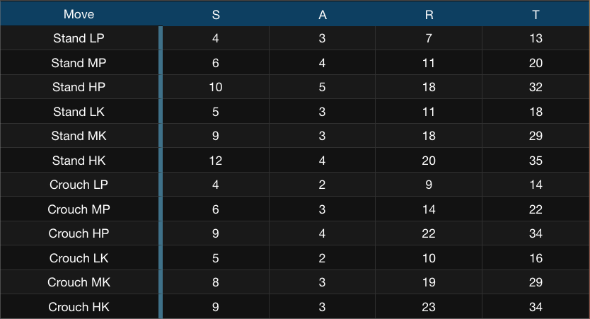
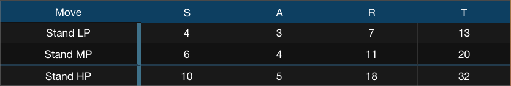
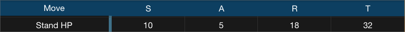
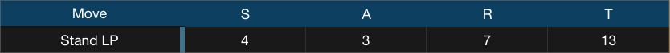
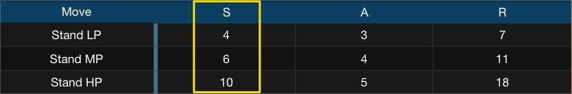
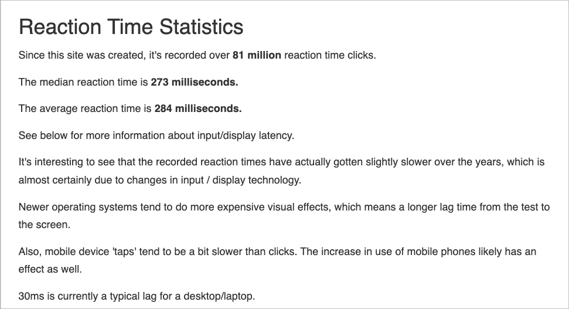

# Frame Data
## What is it?
Frame data refers to the numerical properties of each move in the game.   

## Why is it important?

## How does it fit in with the big picture?

## What are some ways to use it

## How does it work?

## Examples
### Example A

### Example B

### Example C